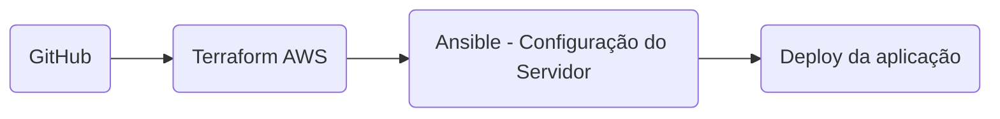

# Projeto de Infraestrutura AWS com Terraform e Ansible

Uma infraestrutura básica na AWS configurada com Terraform para provisionamento e Ansible para configuração.


## Tecnologias Utilizadas
- Linguagem: HCL (HashiCorp Configuration Language) para Terraform, YAML para Ansible
- Frameworks: Terraform, Ansible
- Tecnologias: AWS (EC2, VPC, Subnets, Internet Gateway, Route Tables), Nginx, Prometheus, Grafana

## Descrição do Projeto
Este projeto provisiona uma infraestrutura básica na AWS, configurando uma VPC, subnets públicas, gateway de internet, uma instância EC2 e diversas ferramentas como Nginx, Prometheus e Grafana usando Terraform e Ansible.

## Instruções de Instalação e Uso

 Pré-requisitos
- Terraform instalado
- Ansible instalado
- Conta na AWS e credenciais configuradas
- S3, DynamoDB configurados (para backend do terraform)
- Pares de chaves criadas

Passos para Instalar e Usar

* Clone este repositório para sua máquina local:
```bash
git clone https://github.com/guidssantos/devops-challenge.git
```

- Configure as variáveis dos arquivos main.tf:
```bash
terraform {
  backend "s3" {
    bucket         = "bucket-s3"
    key            = "state-key"
    region         = "region"
    dynamodb_table = "dynamo-table"
    encrypt        = true
  }
}


module "aws-prod" {
  source = "./infra"
  instance_type = "instance-type"
  ami_id = "ami-type"
  key_name = "key-par"
  securityGroup = "securityGroupName"
  name = "project-name"
}
```


- Inicialize o Terraform:
```bash
terraform init
```

- Faça o planejamento do Terraform:
```bash
terraform plan
```


- Aplique a configuração do Terraform se estiver tudo certo:
```bash
terraform apply
```

- Rode o seguinte script para criação do inventory.ini:
```bash
./generate_inventory.sh
```

- Após a instancia ser criada, execute o playbook do Ansible:

```bash
ansible-playbook -i ansible/inventory.ini ansible/playbook.yml
```

- Agora, você pode acessar as seguintes urls:
```bash
IP_DA_ISTANCIA:80   - NGINX (HTML)
IP_DA_ISTANCIA:9090 - PROMETHEUS
IP_DA_ISTANCIA:9093 - PROMETHEUS
IP_DA_ISTANCIA:3000 - GRAFANA
```

- Você também pode acessar a instancia:
```bash
ssh -i path/to/your-key.pem ubuntu@instance-ip
```

## Diagrama de Fluxo da Pipeline



## Explicação da Pipeline

O arquivo main.yml dentro das pastas .github/workflows define o fluxo da pipeline, que é acionada automaticamente em cada push na branch 'main'

- Terraform Job: Este job configura e provisiona a infraestrutura na AWS usando Terraform.

- Passos: Inicializa o Terraform, valida a configuração e aplica as mudanças na infraestrutura.
- Ansible Job: Após a provisionamento da infraestrutura, este job configura o servidor remoto usando Ansible.

- Passos: Executa o playbook Ansible (playbook.yml) que configura o servidor com Nginx, Prometheus, Grafana, entre outras configurações necessárias.

## Explicação Processo de Desenvolvimento

### Definição dos Requisitos e Objetivos

Inicialmente, os requisitos do teste técnico incluíam a criação de uma pipeline para entrega contínua de uma aplicação de monitoramento. O objetivo era automatizar o provisionamento da infraestrutura na AWS utilizando Terraform e configurar o servidor com software como Nginx, Prometheus e Grafana através do Ansible.

### Pesquisa e Planejamento Inicial

Para atender aos requisitos, fiz uma pesquisa detalhada sobre as capacidades e integrações entre Terraform, Ansible e GitHub Actions:

- Terraform: Documentação oficial da HashiCorp, tutoriais online sobre configuração de VPCs e subnets na AWS.

- Ansible: Guia de instalação e uso do Ansible, exemplos de playbooks para instalação e configuração de serviços como Nginx, Prometheus e Grafana.

- GitHub Actions: Documentação oficial do GitHub sobre workflows, integração com Terraform e Ansible através de Actions.

### Arquitetura da Solução

A solução foi arquitetada com base nos seguintes componentes principais:

- Terraform: Configuração de uma Virtual Private Cloud (VPC), subnets públicas, Internet Gateway e instância EC2 para hospedar a aplicação.

- Ansible: Playbook para instalar e configurar Nginx como servidor web, Prometheus para monitoramento e Grafana para visualização de métricas.

### Desafios Enfrentados e Soluções Propostas

Durante o desenvolvimento, um dos principais desafios foi realizar a implementação da pipeline com GitHub Actions e garantir a configuração correta das permissões e segurança na AWS e no servidor EC2. Para isso, implementei regras de segurança usando grupos de segurança e chaves SSH protegidas por segredos no GitHub e realizei pesquisar para melhorar a pipeline.

### Considerações de Segurança e Boas Práticas

Segui boas práticas de segurança, como o uso de variáveis de ambiente criptografadas (secrets) no GitHub Actions e a gestão cuidadosa de chaves SSH.

### Avaliação Final e Lições Aprendidas

A implementação da pipeline de entrega contínua foi bem-sucedida em automatizar o provisionamento e configuração da infraestrutura na AWS. Identifiquei oportunidades de otimização na gestão de dependências e na escalabilidade da infraestrutura para futuras iterações do projeto.

>  This is a challenge by [Coodesh](https://coodesh.com/)
